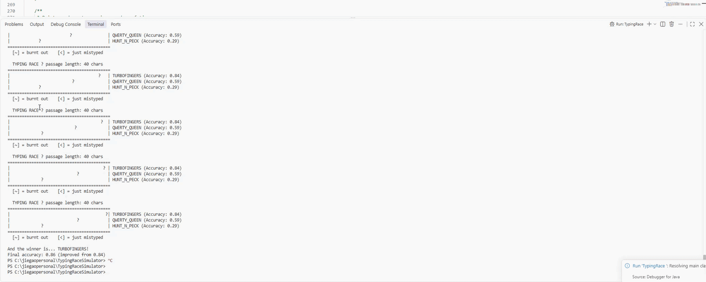

# Typing Race Simulator 🏎️⌨️

A modular, turn-based terminal simulation written in pure Java that models a competitive typing race between autonomous typists. The engine simulates typing progression, dynamic accuracy changes, mistype penalties, and burnout states using probabilistic mechanics.

---

## 📽️ Preview



---

## 🚀 Key Features

- **Autonomous Agent Simulation:** Competitors race across a passage, advancing character by character according to individual accuracy profiles.
- **Probabilistic State Transitions:**
  - **Mistype Penalties:** Inaccurate typists face a higher probability of mistyping and sliding backwards along the track.
  - **Burnout Mechanism:** High-speed typists pushing their limits can experience temporary burnout, pausing progress for recovery.
- **Dynamic Accuracy Evolution:** Winners receive post-race accuracy rewards reflecting skill improvement over time.
- **Real-Time Terminal Visualization:** Dynamic ASCII track rendering complete with custom competitor avatars, progress bounds, and status flags (`[~]` for burnout, `[<]` for recent mistypes).
- **Defensive Design:** Strict boundary clamping ensuring accuracy values remain within $[0.0, 1.0]$ and progress cannot fall below the starting line.

---

## 🏗️ Architecture & OOP Concepts

The application is structured around fundamental Object-Oriented Programming (OOP) principles:

- **`Typist.java` (Domain Entity):** Encapsulates agent state (name, symbol, accuracy, progress, burnout counters) and exposes clean mutator/accessor methods adhering to data hiding and encapsulation.
- **`TypingRace.java` (Simulation Controller):** Manages the race lifecycle, passage constraints, execution loop, step delays, terminal rendering, and win-condition evaluations.

---

## 🛠️ Getting Started

### Prerequisites
- **Java Development Kit (JDK 8 or higher)** installed on your machine.

### Installation & Run

1. **Clone the repository:**
   ```bash
   git clone https://github.com/jiegaoooooooooooo/typing-race-simulator.git
   cd typing-race-simulator
   ```

2. **Compile the Java source files:**
   ```bash
   javac Typist.java TypingRace.java
   ```

3. **Run the simulation:**
   ```bash
   java TypingRace
   ```

---

## ⚙️ Configuration

You can customize competitor setups or race parameters directly inside `TypingRace.main()`:

```java
TypingRace race = new TypingRace(40); // Sets passage length (chars)

// Add typists: symbol, name, baseline accuracy (0.0 to 1.0)
race.addTypist(new Typist('①', "TURBOFINGERS", 0.85), 1);
race.addTypist(new Typist('②', "QWERTY_QUEEN",  0.60), 2);
race.addTypist(new Typist('③', "HUNT_N_PECK",   0.30), 3);

race.startRace();
```

---

## 👤 Author

- **Jiegao Chen** - [GitHub Profile](https://github.com/jiegaoooooooooooo)